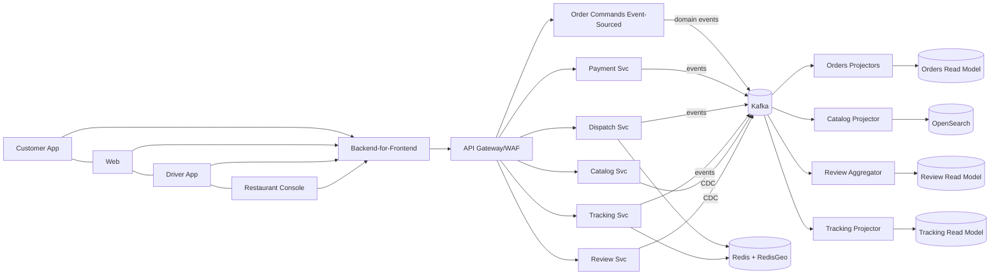

# Food Delivery Platform — Scalable & Efficient Architecture

**Date:** Sep 27, 2025

A cloud-native, event-driven platform for food delivery with geo-aware dispatch, real-time tracking, and resilient payment flows. Designed to meet **99.8% availability**, **≤2s end-user page load**, and scale from **1,000 orders/sec** (Year 1 peak) to **~3,700 orders/sec** by Year 5 (30% CAGR).

## Quick Links
- [Assumptions](docs/01-assumptions.md)
- [Architecture Diagrams](docs/02-architecture.md)
- [Tech Stack & Frameworks](docs/03-tech-stack.md)
- [Milestone Plan](docs/04-milestones.md)
- [Staffing Plan](docs/05-staffing.md)
- [Architecture Decision Records](adr/0001-record-architecture-decisions.md)
---

## Executive Snapshot

- **Throughput:** Start 1,000 orders/sec (peak); 30% YoY → ~3,713 orders/sec (Yr5).
- **Latency SLO:** p95 page load ≤ 2s; API p95 ≤ 300–500ms on core apis.
- **Availability SLO:** 99.8% (Downtime ≈ 86.4 min/month).
- **Architecture:** Microservices, CQRS (for orders), Kafka streaming, Redis (& RedisGeo), Postgres OLTP, OpenSearch for discovery, ClickHouse/BigQuery for analytics, WebSockets for live tracking.
- **Reliability:** Multi‑Availability Zones, rollout/canary deploys, circuit breakers, retries with backoff, DR in secondary region.
- **Security:** OIDC/JWT, TLS everywhere, tokenized payments, DPDP (India) & PCI

### Context Diagram

### Milestones (Gantt)

---