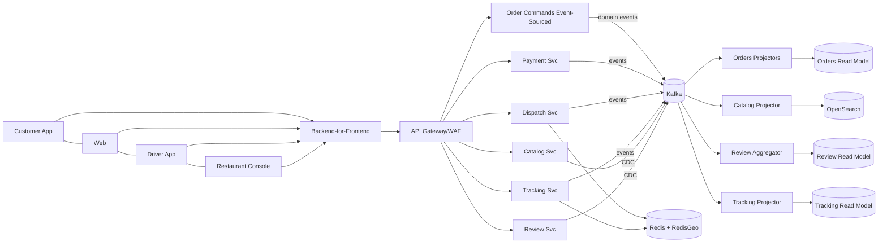
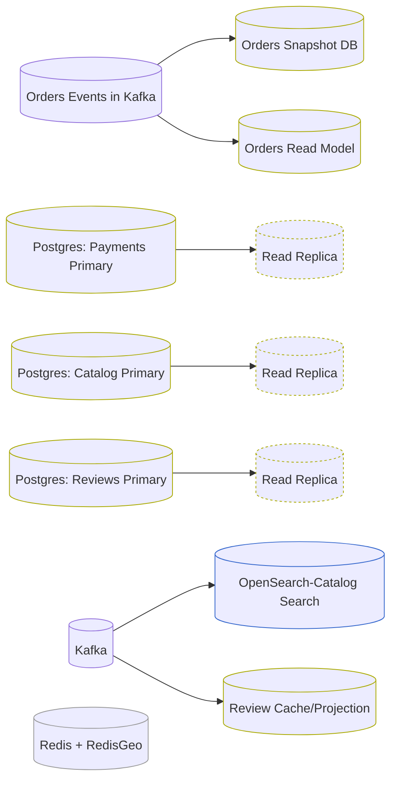
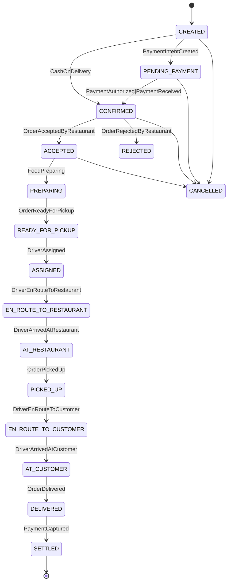
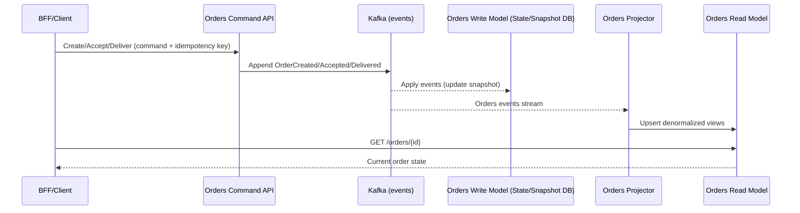
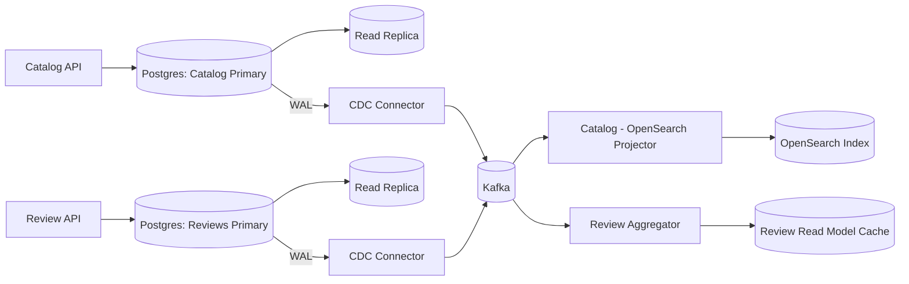
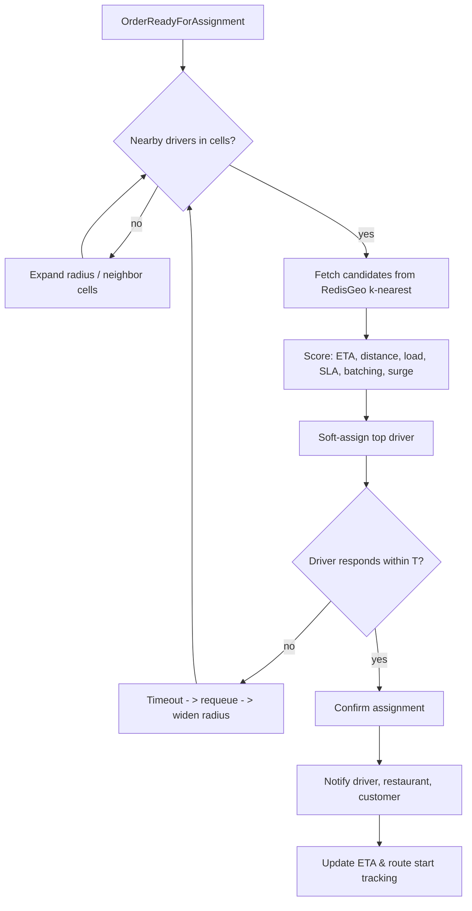
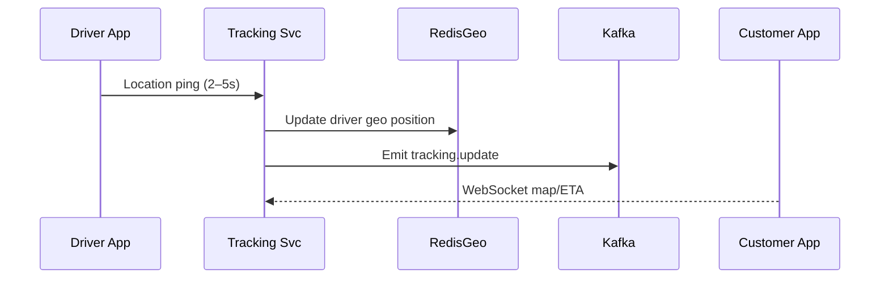

# Architecture Diagrams & Flows

## Context

##  Data Ownership & Read Replicas

## Order State

## Order Flow - Order CQRS (Event Sourcing)

## Catalog/Reviews CRUD + CDC

## Dispatch Flow (low-latency)

## Tracking (pings → WebSocket)

