# Architecture Diagrams & Flows

## Context
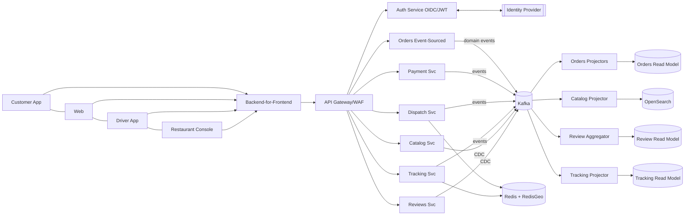
### Authentication - Event Sourcing - CDC
- Authentication: Clients hit BFF → API Gateway, which validates tokens with Auth Service (OIDC/JWT) backed by your IdP; downstream services trust JWTs. 
- Event sourcing: Only Orders is event-sourced (commands → domain events). Catalog & Reviews are CRUD with CDC to Kafka; other services publish events but are not event-sourced.
- Payments: PSPs are the source of truth; we need a deterministic ledger & reconciliation over complex event streams. A ledger + idempotent state machine + CDC/outbox gives auditability and PCI-friendly control without ES overhead. 
- Dispatch/Tracking: Ultra-low-latency, geo-indexed ephemeral state (Redis/RedisGeo) — event sourcing adds write/rehydration latency with little benefit; we still emit events for history/analytics. 
- Catalog/Reviews: Mostly CRUD with heavy reads; Postgres + read replicas + CDC → Kafka keeps it simple and scalable, while ES would complicate write paths without clear ROI.

## Authentication - RBAC

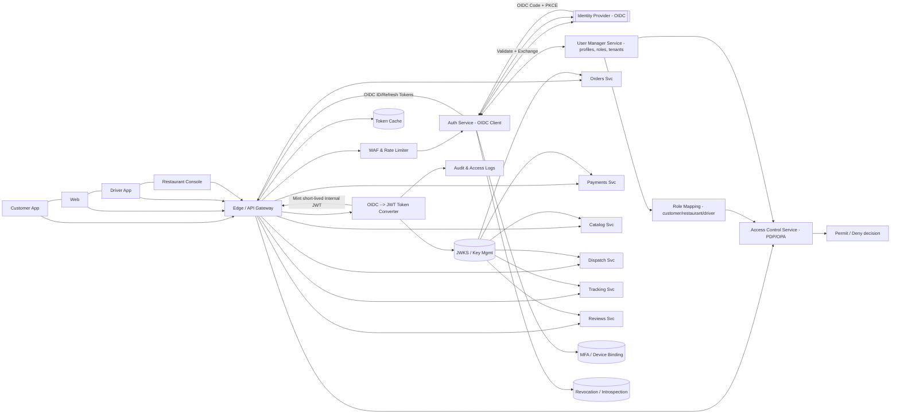
### User Manager and Access Control

- User Manager Service (UMS): source of truth for profiles, roles, tenants/cities, restaurant memberships; feeds role mapping and attributes (e.g., restaurant_id, driver_id) used in ABAC. 
- Access Control Service (ACS): policy decision point (PDP) using OPA/rego or similar; evaluates RBAC + ABAC with inputs from UMS and request context; Edge asks ACS for permit/deny before routing.

##  Login Flow - (login → authorize → route)
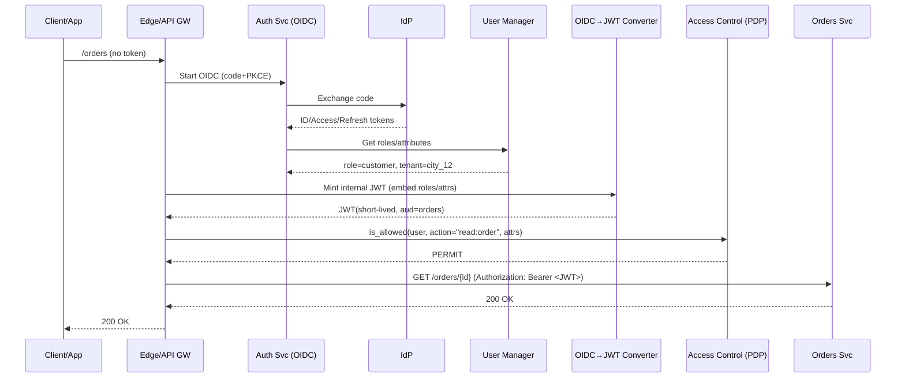
### JWT claims
- sub, exp, role, scopes, tenant, city_id, customer_id|restaurant_id|driver_id (as applicable), app_version.

##  Data Ownership & Read Replicas

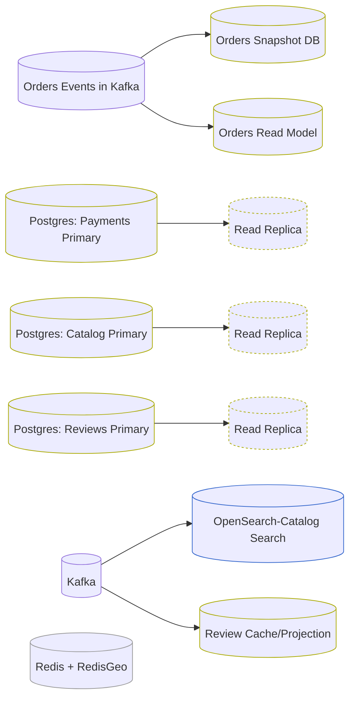

## Order State
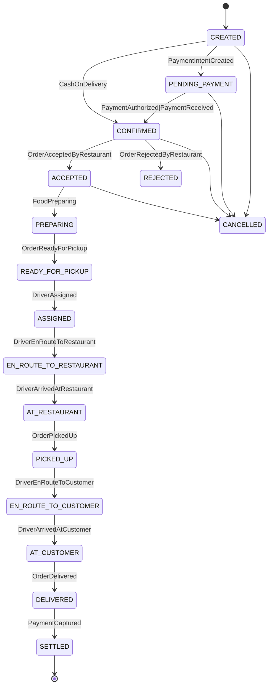

## Order Flow - Order CQRS (Event Sourcing)

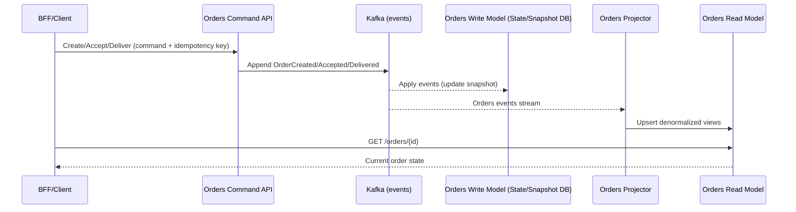

## Catalog/Reviews CRUD + CDC

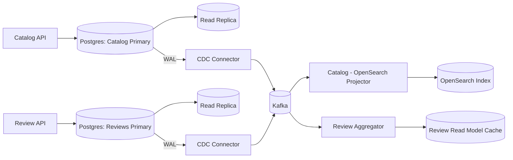

## Dispatch Flow (low-latency)

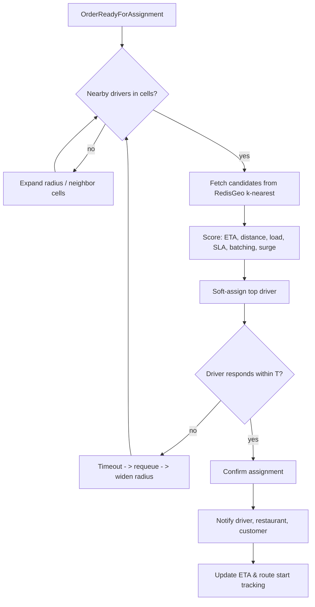

## Tracking (pings → WebSocket)

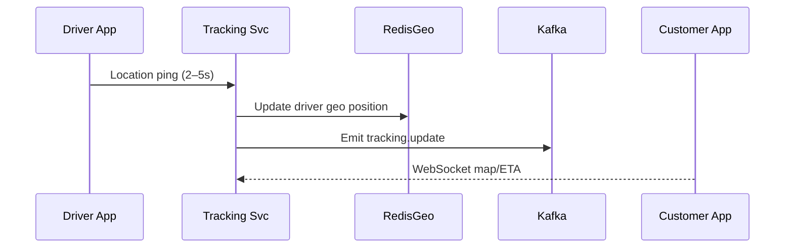

## User Journeys

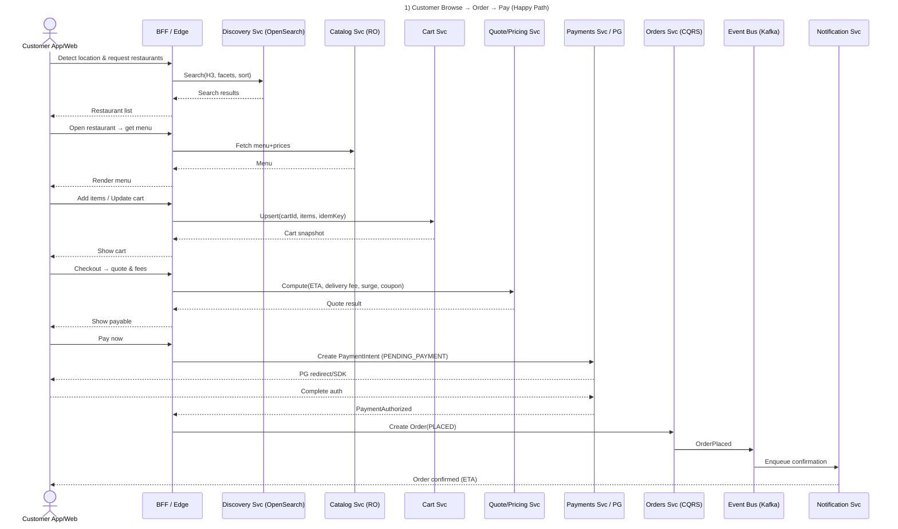

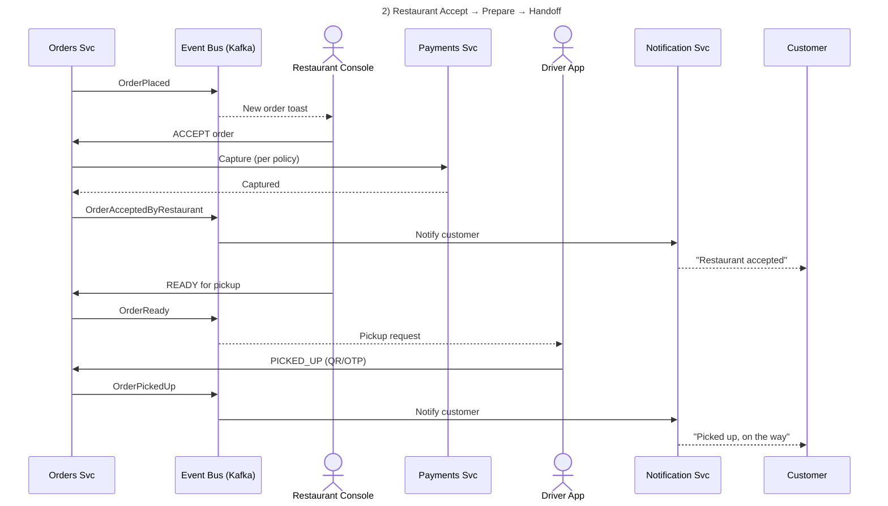

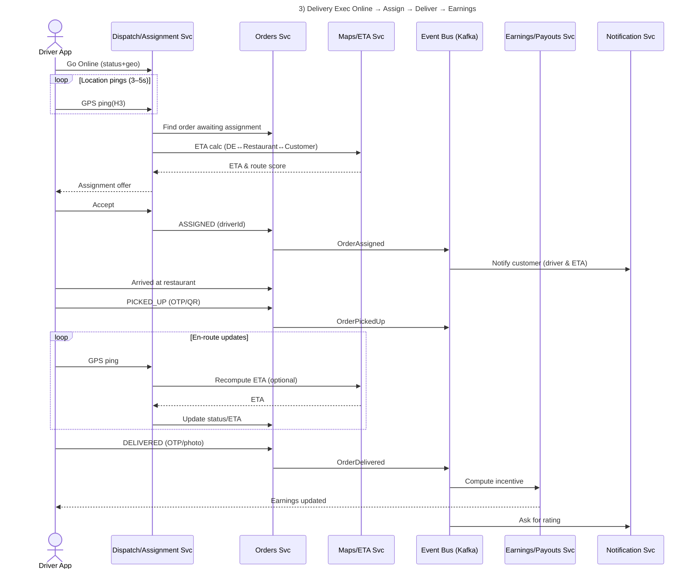

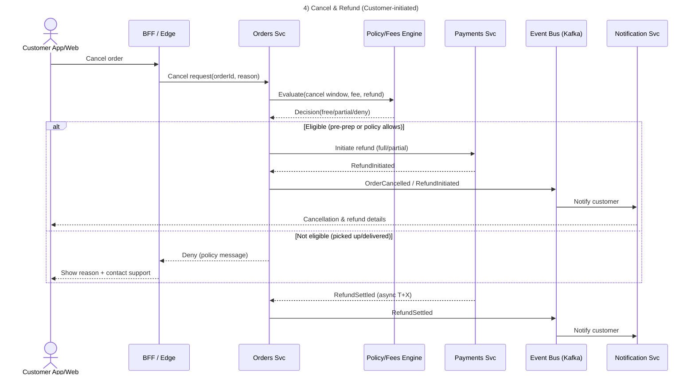