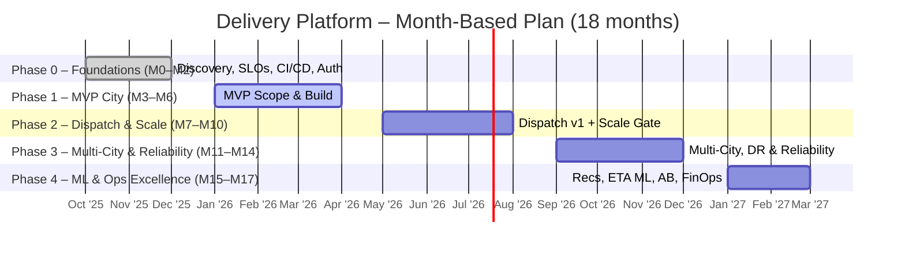

# Milestone Plan  (**18-Month** Horizon)

### Phase Details
- Phase 0 – Foundations (M0–M2)
- Phase 1 – MVP City (M3–M6)
- Phase 2 – Dispatch & Scale (M7–M10)
- Phase 3 – Multi-City & Reliability (M11–M14)
- Phase 4 – ML & Ops Excellence (M15–M17)

## phase timeline

### Phase 0 — Foundations (M0–M2)

- M0: SLOs & KPIs defined, domain modeling, repo scaffolds,CI/CD v1, auth provider selected. (keycloak/cognito/Auth0)
- M1: Core environments (dev/test/stage/prod), observability v1 (Open Telemetry traces, metrics, logs), API gateway/WAF, BFF skeleton. 
- M2: Security hardening (secrets/KMS, TLS), cost guardrails, synthetic checks, performance budgets, runbooks v1. 
-  **Exit criteria:** Environments live, CI/CD green, SLO dashboards up, auth end-to-end working.

### Phase 1 — MVP City (M3–M6)

- M3: Catalog & Search (write + OpenSearch/ElasticSearch projection), Cart, basic Promotions, Restaurant Console v1, User journeys. 
- M4: Orders (commands + events), Payments (PSP, tokenization, webhooks), BFF endpoints for core flows. 
- M5: Driver app beta (RN), Tracking service (pings 2–5s), Notifications (FCM/APNs/Email), Ratings/Reviews. 
- M6: Hardening: idempotency, retries with backoff/circuit breakers, API p95 ≤ 500ms, page p95 ≤ 2s; pilot city readiness. 
- **Exit criteria:** E2E happy path stable; All success user journeys; order success ≥ 99.5%; 

### Phase 2 — Dispatch & Scale (M7–M10)

- M7: RedisGeo + H3 cells (Geo Hashing), candidate fetch, scoring v1 (ETA, distance, load), assignment loop.
- M8: Surge controls, batching, timeouts/requeue strategy, backpressure, PSP webhook outbox/CDC guards. 
- M9: Observability deep-dive (Kafka lag SLOs, queue incoming/outgoing dashboards, hot partition alerts), capacity tests 500–1000 orders/sec. 
- M10: Cost/FinOps dashboards, auto-scaling policies (HPA/VPA/Karpenter), failure drills (maps/PSP outages). 
- **Exit criteria:** Peak ≥ 1000 orders/sec; time-to-assign for dispatch p95 ≤ 10s; zero data loss

### Phase 3 — Multi-City & Reliability (M11–M14)
- M11: Multi-tenant configs (city/region), per-city routing, config service, feature flags by city. 
- M12: DR (Disaster Recovery) prep: cross-region snapshots, Kafka replication strategy, traffic shadowing. 
- M13: DR drill (region switch), error-budget policy, incident playbooks v2. 
- M14: Scale tests to ~1,000 orders/sec; read-replica strategy validated (Orders snapshots/reads, Payments, Catalog, Reviews). 
- Exit criteria: DR switch with success; 1k orders/sec with SLOs met.

### Phase 4 — ML & Ops Excellence (M15–M17)

- M15: Prep-time & ETA ML v1 (feature store, feature engineering), AB testing framework, experimentation. 
- M16: Recommendations (home feed/rank, user/item based recommenders), Clustering and classification: fraud signals v1, loyalty/retention hooks. 
- M17: Cost optimization passes; p95 page ≤ 2s; on-call maturity with runbooks or playbooks 
- Exit criteria: SLOs consistently green; ML improves ETA p50 error & conversion; unit economics dashboards live.